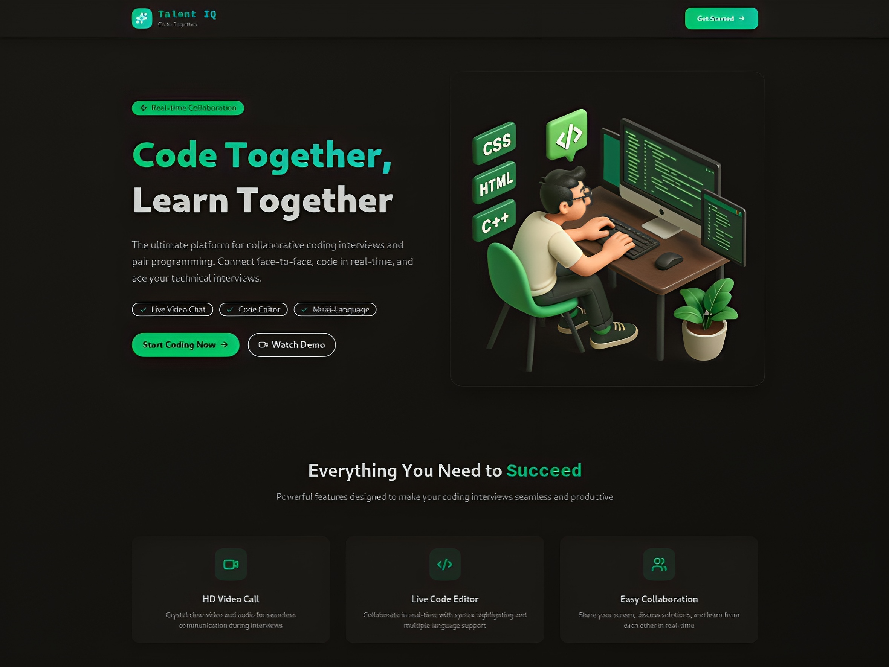

# Talent-IQ

Full-stack interview preparation platform for coding, system design, aptitude, and verbal practice.



## Overview
Talent-IQ combines async practice and live mock interviews in one workflow so candidates can prepare end-to-end in a single product.

## Quick Links
- [Features](#features)
- [Tech Stack](#tech-stack)
- [Project Structure](#project-structure)
- [Environment Variables](#environment-variables)
- [Local Development](#local-development)
- [Docker Setup](#docker-setup)
- [API Snapshot](#api-snapshot)

## Features
- Multi-category problem bank: Coding, System Design, Aptitude, Verbal
- Monaco-based editor with language-aware starter templates (JavaScript, Python, Java)
- Auto-check against expected outputs
- Live 1:1 interview rooms with real-time video and chat
- AI-generated post-session feedback
- Session summaries with attempts, success rate, and score
- Google OAuth + JWT authentication flow
- Dashboard and profile analytics (accuracy, readiness meter, solved breakdown)

## Tech Stack
| Layer | Technologies |
| --- | --- |
| Frontend | React 19, Vite 7, Tailwind CSS 4, React Router 7, TanStack Query 5, Axios, Monaco Editor |
| Backend | Node.js (ES Modules), Express 5 |
| Database | MongoDB 7, Mongoose 8 |
| Realtime | Stream Video React SDK, Stream Chat, stream-chat-react |
| AI + Async Jobs | OpenAI API, Inngest |
| Auth + Security | bcryptjs, Google OAuth (`@react-oauth/google`, `google-auth-library`), JWT, cookie-based sessions |
| Dev Tooling | ESLint 9, Nodemon, Docker, Docker Compose |

## Project Structure
```text
talent-IQ/
  backend/              # Express API, auth, sessions, AI endpoints
  frontend/             # React app, pages, components, problem engine
  docker-compose.yml
```

## Environment Variables
### Backend (`backend/.env`)
Use `backend/.env.example` as base:

```bash
PORT=3000
NODE_ENV=production
DB_URL=

INNGEST_EVENT_KEY=
INNGEST_SIGNING_KEY=

STREAM_API_KEY=
STREAM_API_SECRET=

JWT_SECRET=
CLIENT_URL=http://localhost:8080
GOOGLE_CLIENT_ID=

OPENAI_API_KEY=
OPENAI_MODEL=gpt-4o-mini
```

### Frontend (`frontend/.env`)
```bash
VITE_API_URL=http://localhost:3000/api
VITE_STREAM_API_KEY=
VITE_GOOGLE_CLIENT_ID=
```

## Local Development
### 1. Start Backend
```bash
cd backend
npm install
npm run dev
```

### 2. Start Frontend
```bash
cd frontend
npm install
npm run dev
```

Frontend runs on `http://localhost:5173` by default.

## Docker Setup
Run from project root:

```bash
docker compose up -d --build
```

Services:
- Frontend: `http://localhost:8080`
- Backend health: `http://localhost:3001/health`
- MongoDB: `mongodb://localhost:27017`

Useful commands:
```bash
docker compose logs -f
docker compose down
```

## API Snapshot
- `POST /api/auth/register`
- `POST /api/auth/login`
- `POST /api/oauth/google`
- `POST /api/sessions`
- `GET /api/sessions/active`
- `GET /api/sessions/my-recent`
- `POST /api/sessions/:id/join`
- `POST /api/sessions/:id/end`

## Why It Stands Out
- Unifies async practice and live interview simulation
- Covers both technical and non-technical interview rounds
- Creates a built-in feedback loop with analytics and readiness tracking

## License

MIT
